# 功能介绍与使用说明

> Super_ADB 核心功能模块的详细介绍、操作步骤与界面展示。

## 🖥️ 主界面

**功能介绍**

主界面采用左侧设备列表 + 右侧 Tab 页面的布局，顶部为系统操作区，底部为状态栏。集成设备连接、系统操作、应用管理、文件传输、日志抓取、性能监控六大核心功能于一体。

**使用说明**

1. 启动后自动扫描已连接的 USB 设备和局域网设备
2. 左侧列表选择目标设备，右侧 Tab 切换功能页面
3. 顶部按钮区提供一键重启、代理设置、投屏、抓包等快捷操作
4. 标题栏下拉菜单可切换 6 套主题，设置自动保存

---

## 🔌 设备连接与无线调试

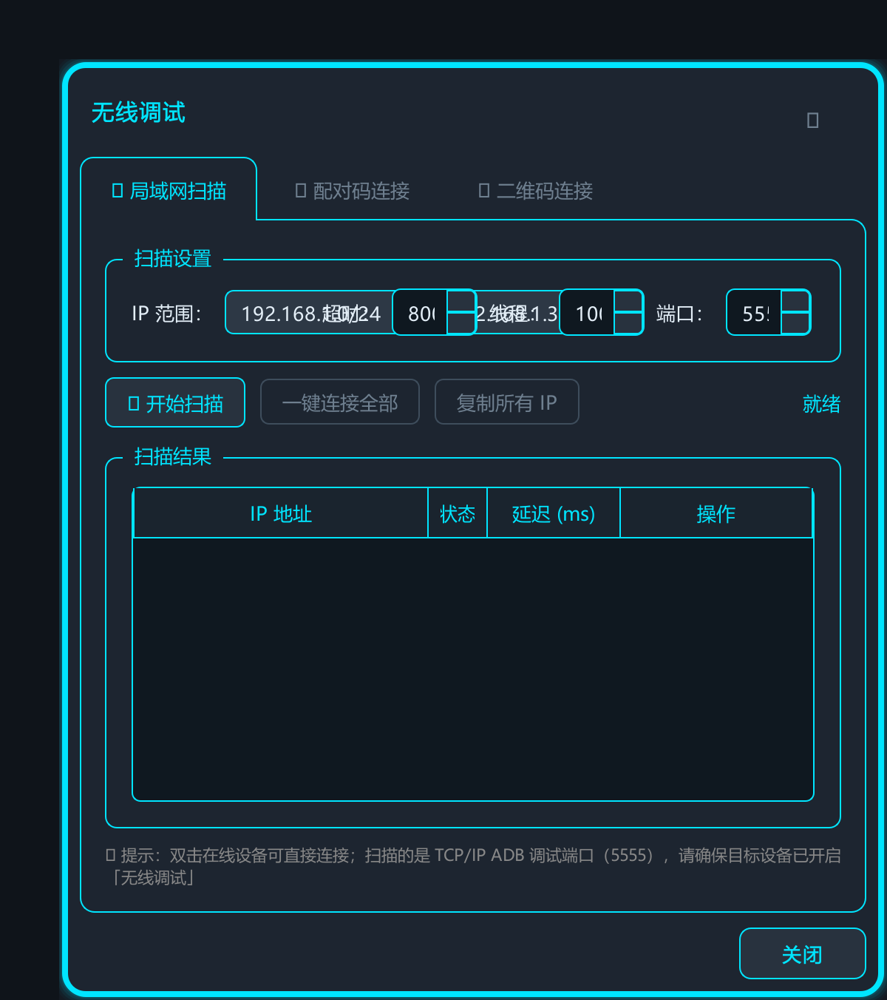

**功能介绍**

三合一无线调试弹窗，支持局域网扫描自动发现、配对码连接（adb pair）、二维码连接（mDNS 自动监听 + 扫码回填）三种方式。同时支持 USB 直连，自研 ADB 协议栈与官方 adb 可一键切换。

**使用说明**

1. **USB 连接**：手机开启 USB 调试，插入数据线，设备列表自动出现
2. **局域网扫描**：点击「无线调试」→「局域网扫描」，自动扫描 5555 端口设备
3. **配对码连接**：手机开发者选项 → 无线调试 → 使用配对码配对，输入 6 位配对码
4. **二维码连接**：手机展示配对二维码，PC 端扫码自动完成 mDNS 发现与配对

---

## 📡 局域网扫描

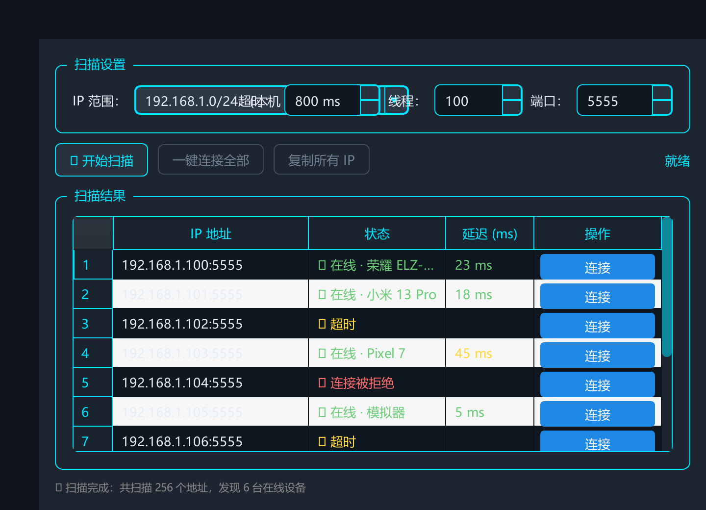

**功能介绍**

局域网设备扫描工具，自动探测网段内开启 ADB 调试（5555 端口）的设备，显示 IP、设备型号、连接状态。支持自定义网段和超时时间，扫描结果可一键连接。

**使用说明**

1. 点击「局域网扫描」自动探测当前网段
2. 扫描过程中实时显示发现的设备及响应时间
3. 点击设备行即可快速连接，连接成功后自动加入设备列表
4. 支持自定义 IP 段扫描，适配不同网络环境

---

## 🔍 IP 扫描

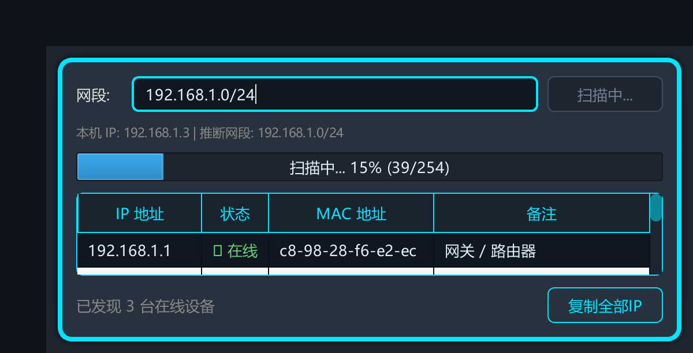

**功能介绍**

指定 IP 地址的设备连接工具，支持手动输入 IP 和端口，自动检测设备是否在线。适用于局域网扫描未覆盖到的设备，或已知 IP 的直连场景。

**使用说明**

1. 在 IP 输入框中填写设备 IP 地址（缺省端口自动补 5555）
2. 点击「连接」前自动 ping 检测设备是否在线
3. 连接成功后设备出现在主界面设备列表
4. 连接失败时显示具体原因（超时/拒绝/未授权等）

---

## 📶 WiFi 管理

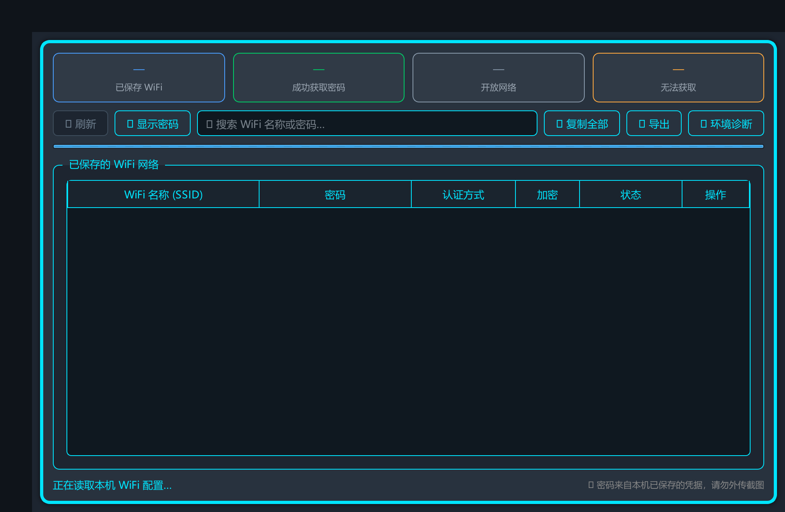

**功能介绍**

设备 WiFi 网络管理工具，查看已保存的 WiFi 列表、当前连接状态、信号强度，支持忘记网络、重新连接、查看 WiFi 密码（需 root）。

**使用说明**

1. 打开后自动加载设备已保存的 WiFi 列表
2. 显示每个 WiFi 的 SSID、信号强度、加密方式、连接状态
3. 点击「连接」切换 WiFi，「忘记」移除已保存网络
4. root 设备可查看已保存 WiFi 的明文密码

---

## 🔑 WiFi 配对

**功能介绍**

WiFi 配对连接工具，通过 adb pair 命令完成 Android 11+ 无线调试配对。输入配对码和端口，自动完成配对并连接，配对成功后设备可通过 WiFi 调试。

**使用说明**

1. 手机开发者选项 → 无线调试 → 使用配对码配对设备
2. 将手机显示的 6 位配对码和端口填入工具
3. 点击「配对」自动执行 adb pair，配对成功后自动连接
4. 配对信息保存后，后续可直接连接无需再次配对

---

## 📁 文件管理

**功能介绍**

设备文件树浏览器，支持上传/下载、删除、重命名、权限修改（右键「授权 777」）、文本预览、递归搜索。自研 ADB sync 协议快速传输，上传速度可达官方 adb 的 2.7 倍。只读分区自动检测并附解锁引导。

**使用说明**

1. 选择设备后自动加载根目录文件列表
2. 双击文件夹进入，点击路径栏可快速跳转
3. 拖拽本地文件到窗口即可上传，右键文件可下载/删除/重命名
4. 搜索框支持当前路径和递归搜索两种模式
5. 右键「授权 777」可快速修改文件权限（需 root）

---

## 📦 应用管理（安装/解包）

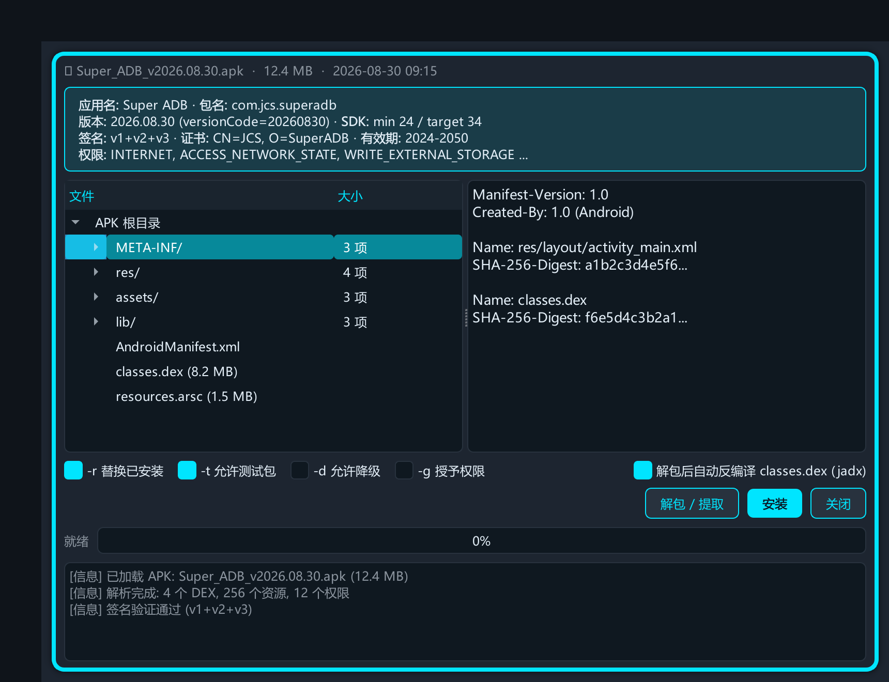

**功能介绍**

APK 安装与解包工具，支持拖拽安装、批量安装、安装进度实时显示、APK 元信息解析（包名/版本/权限/组件）、解包查看资源。三阶段安装流程（push → pm install → rm），失败时自动诊断原因。

**使用说明**

1. 拖拽 APK 文件到窗口，或点击「选择 APK」浏览
2. 自动解析 APK 信息（包名、版本、权限列表、四大组件）
3. 点击「安装」开始，进度条实时显示上传和安装进度
4. 安装失败时显示具体原因（空间不足/签名冲突/版本降级等）
5. 「解包」可查看 APK 内部资源文件结构

---

## 📋 日志抓取

**功能介绍**

多标签 logcat 查看器，支持关键字过滤、标签/进程/消息星标、实时流式输出、日志级别筛选、导出保存。可同时打开多个设备的日志标签页，互不干扰。

**使用说明**

1. 选择设备后自动启动 logcat 实时输出
2. 顶部过滤框输入关键字实时过滤，支持正则表达式
3. 点击日志行左侧星标可标记重要日志，过滤栏可只看星标
4. 右键可复制单行/全部日志，或导出为 .txt 文件
5. 「新建标签」可同时监控多个设备或多个过滤条件

---

## 📊 性能监控

**功能介绍**

双层性能监控体系：设备级（CPU 多核分核/内存/温度/FPS/网络速率）+ 应用级（12 项图表指标、内存泄漏自动检测、ANR/OOM 检测、hprof 自动抓取）。支持 HTML 报告导出，数据实时刷新。

**使用说明**

1. **设备级监控**：主界面「性能监控」Tab，实时显示 CPU/内存/温度/FPS 曲线
2. **应用级监控**：选择目标应用，点击「应用性能监控」打开独立窗口
3. 内存泄漏检测自动运行，发现泄漏时自动抓取 hprof 并提示
4. 监控结束后可导出 HTML 报告，包含所有图表和异常记录
5. 图表支持缩放、暂停、数据点查看

---

## 🐒 Monkey 压测

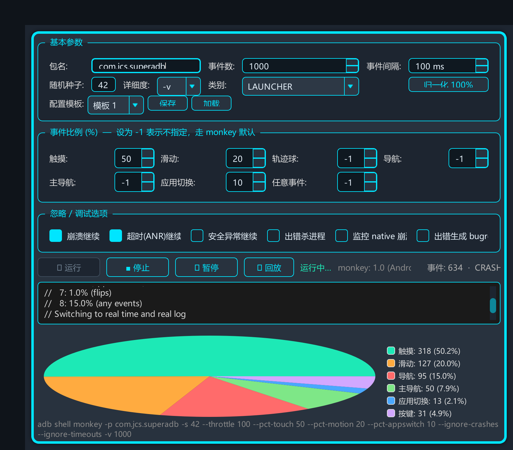

**功能介绍**

Monkey 压力测试管理窗口，支持命令模板自定义、暂停/继续/停止控制、实时事件饼图统计、崩溃报告自动拉取、事件回放。可设置事件数、间隔、种子、触摸/手势/轨迹球比例等参数。

**使用说明**

1. 选择目标应用，设置事件总数、间隔时间、种子等参数
2. 点击「开始」启动 Monkey，实时显示事件统计饼图
3. 运行中可随时「暂停」/「继续」/「停止」
4. 发生崩溃时自动拉取 tombstone 和 logcat 崩溃报告
5. 支持事件回放，用相同种子复现崩溃场景

---

## 🌐 网络抓包

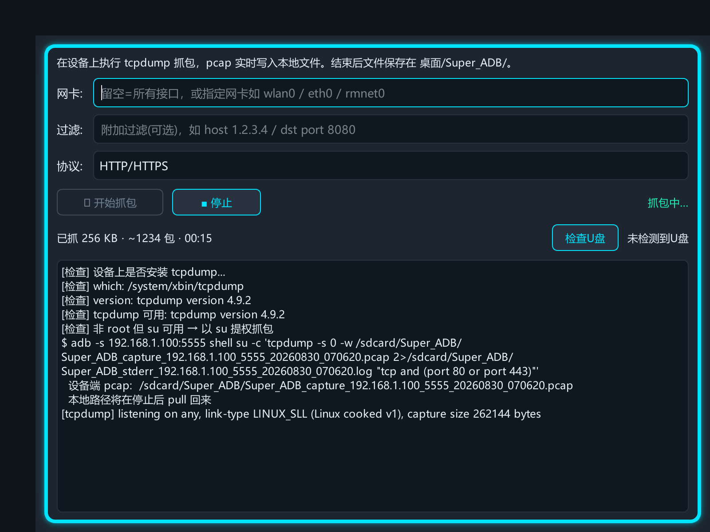

**功能介绍**

tcpdump 网络抓包工具，自动检测设备架构并推送对应 tcpdump 二进制（arm64/arm），支持 BPF 过滤器、实时包数统计、停止后自动拉取 pcap 文件。非 root 设备通过 su 提权抓包，支持自定义保存路径。

**使用说明**

1. 点击「网络抓包」打开窗口，自动检测设备是否已安装 tcpdump
2. 未安装时自动推送对应架构的二进制到 /data/local/tmp/（需 root）
3. 输入 BPF 过滤器（如 "tcp and port 80"），点击「开始抓包」
4. 实时显示捕获包数、过滤器接收数、内核丢包率
5. 点击「停止」自动拉取 pcap 文件到本地

---

## 📈 PCAP 解析

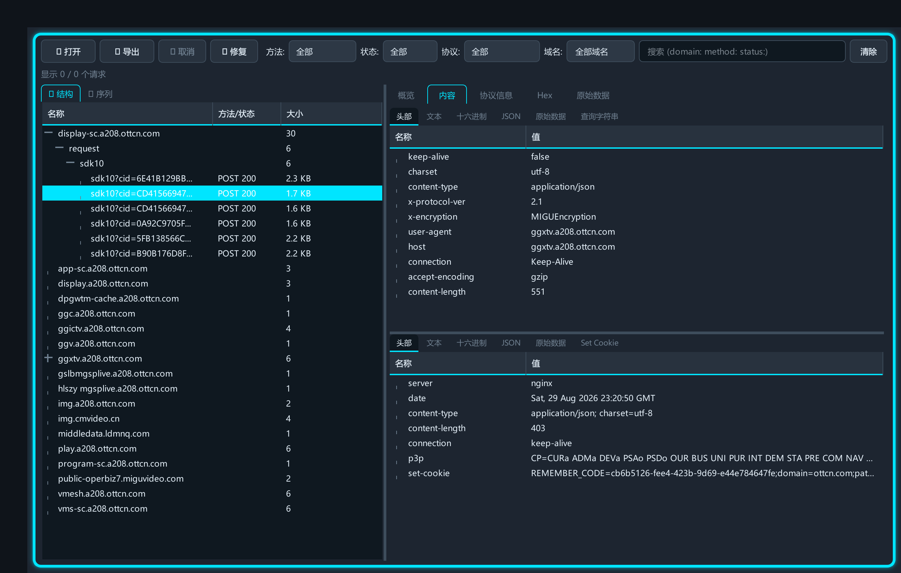

**功能介绍**

PCAP 抓包文件解析器，支持 HTTP/HTTPS/TCP/UDP 协议分析、流重组、请求/响应查看、数据包详细信息展示。可按协议、IP、端口过滤，支持导出单个流的原始数据。

**使用说明**

1. 打开 pcap 文件后自动解析并显示数据包列表
2. 支持按协议（HTTP/TCP/UDP）、源/目标 IP、端口过滤
3. 点击数据包查看详细信息（以太网/IP/TCP/HTTP 各层字段）
4. TCP 流重组功能可查看完整的请求/响应交互
5. 支持导出单个流或过滤后的数据包为新 pcap

---

## 📺 scrcpy 投屏

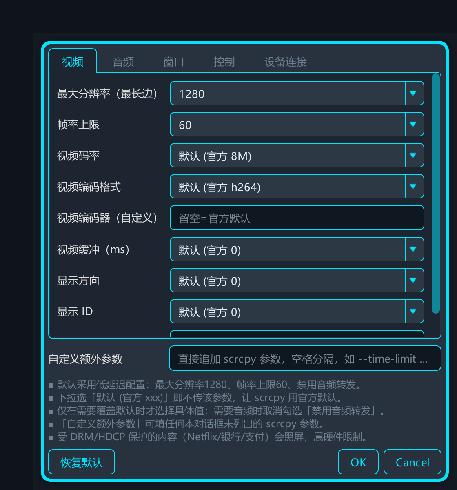

**功能介绍**

集成官方 scrcpy 投屏工具，支持分辨率/码率/帧率/编码器/渲染驱动等参数自定义。低延迟投屏，支持键鼠反向控制、文件拖拽传输、屏幕录制。参数设置自动保存，下次启动自动加载。

**使用说明**

1. 选择设备后点击「投屏」按钮启动 scrcpy
2. 「投屏设置」可调整分辨率（默认 1080p）、码率（默认 8Mbps）、帧率（默认 60fps）
3. 可选择编码器（h264/h265）和渲染驱动（direct3d/opengl/metal）
4. 投屏窗口中可直接用键鼠控制手机，拖拽文件到窗口即可传输
5. 支持屏幕录制，录制文件保存到本地

---

## 💻 ADB 终端

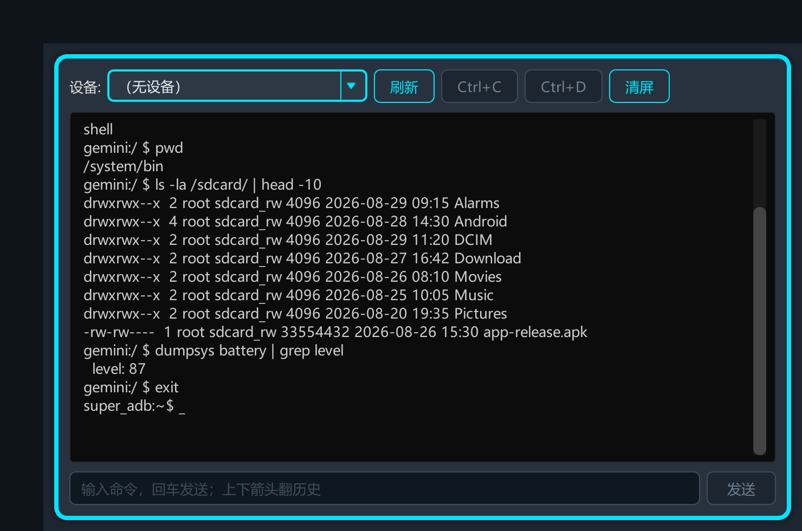

**功能介绍**

交互式 ADB shell 终端，支持命令历史记录（上下键）、Tab 自动补全、多设备切换、实时输出。内置常用命令快捷按钮，支持自定义命令模板，输出可复制和导出。

**使用说明**

1. 选择设备后自动进入 adb shell 交互模式
2. 输入命令回车执行，上下键浏览历史命令，Tab 补全文件名/命令
3. 顶部设备下拉框可快速切换到其他设备的 shell
4. 常用命令（ls/cd/ps/top/dumpsys）一键执行
5. 输出内容可全选复制，支持导出为文本文件

---

## 🛠️ 便捷工具

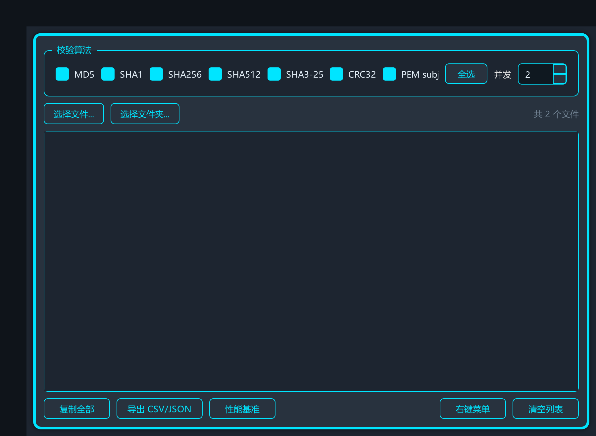

**功能介绍**

集成多款实用小工具的统一入口，包括命令行、JSON 工具、哈希校验、时间戳转换、ADB 终端、设备信息、修改时间、证书安装、环境配置等。工具窗口支持独立打开和多开。

**使用说明**

1. 主界面「便捷工具」按钮打开工具面板
2. 点击工具图标在独立窗口中打开，支持同时打开多个工具
3. 工具窗口位置和大小自动保存，下次打开恢复
4. 每个工具有独立的使用说明和操作提示

---

## 📝 JSON 工具

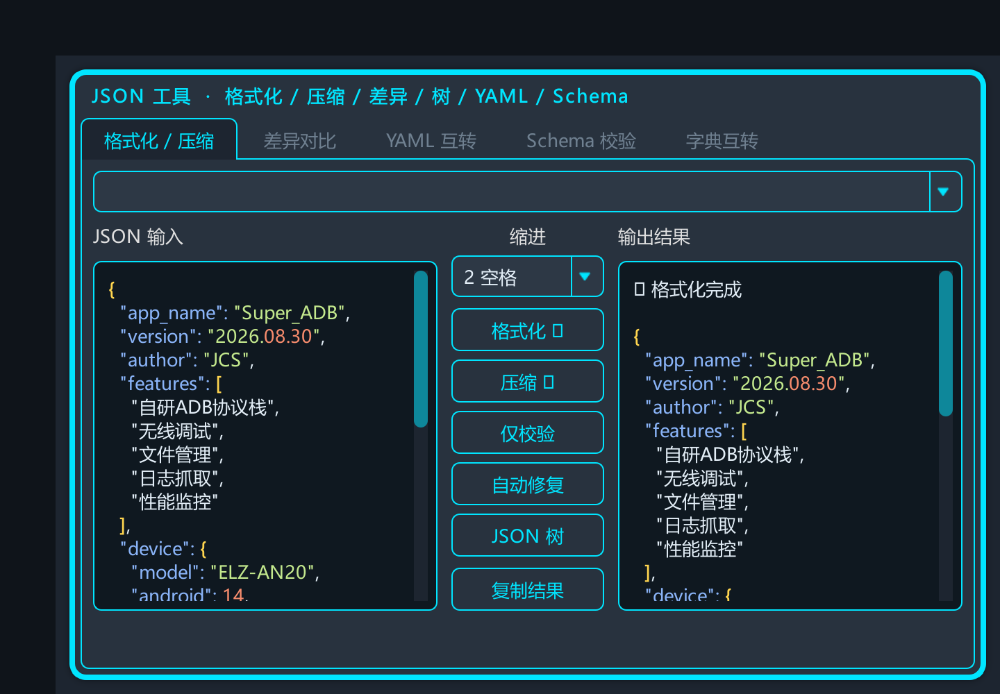

**功能介绍**

JSON 格式化与处理工具，支持格式化/压缩、左右差异对比、YAML 互转、JSON Schema 校验、树形视图展开折叠。大文件自动分页，支持从文件加载和保存结果。

**使用说明**

1. 粘贴 JSON 文本自动格式化，语法错误时标红提示行号
2. 左右两栏对比差异，新增/删除/修改行高亮显示
3. 支持 JSON ↔ YAML 互相转换
4. 树形视图可展开/折叠节点，支持搜索定位
5. 可加载本地 JSON 文件，处理结果保存到本地

---

## 🔐 哈希校验

**功能介绍**

文件哈希校验工具，支持 MD5/SHA1/SHA256/SHA512/CRC32 等 8 种算法同时计算，拖拽文件即算，支持大文件分块读取。可注册 Windows 右键菜单，右键文件直接计算哈希。

**使用说明**

1. 拖拽文件到窗口即开始计算，支持多文件批量计算
2. 8 种算法同时显示，可复制任意一种哈希值
3. 支持输入目标哈希值进行比对，一致/不一致高亮显示
4. 「注册右键菜单」后可在资源管理器右键文件直接计算
5. 大文件采用分块流式读取，不占用过多内存

---

## ⏰ 时间戳转换

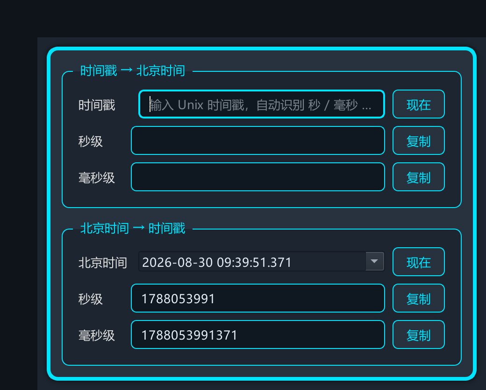

**功能介绍**

时间戳与日期时间双向转换工具，自动识别秒/毫秒/微秒/纳秒单位，支持北京时间和 UTC 时间显示，可获取当前时间戳，支持批量转换。

**使用说明**

1. 输入时间戳自动识别单位并转换为北京时间
2. 输入日期时间自动转换为时间戳（秒/毫秒/微秒/纳秒）
3. 「现在」按钮一键获取当前时间戳和对应时间
4. 支持 UTC 时间和北京时间切换显示
5. 批量转换模式可一次处理多行时间戳

---

## 🕐 修改系统时间

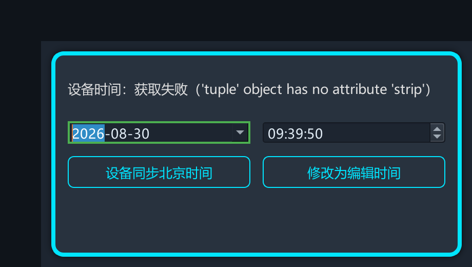

**功能介绍**

修改设备系统时间工具（需 root），支持手动设置日期时间、与 PC 时间同步、NTP 时间同步。修改前自动备份原时间，可一键恢复。

**使用说明**

1. 选择设备后显示当前系统时间
2. 手动设置日期和时间，点击「应用」修改设备时间（需 root）
3. 「同步 PC 时间」一键将设备时间同步为电脑当前时间
4. 「NTP 同步」从网络时间服务器获取标准时间并设置
5. 修改前自动备份，可一键恢复原时间

---

## 📋 设备信息

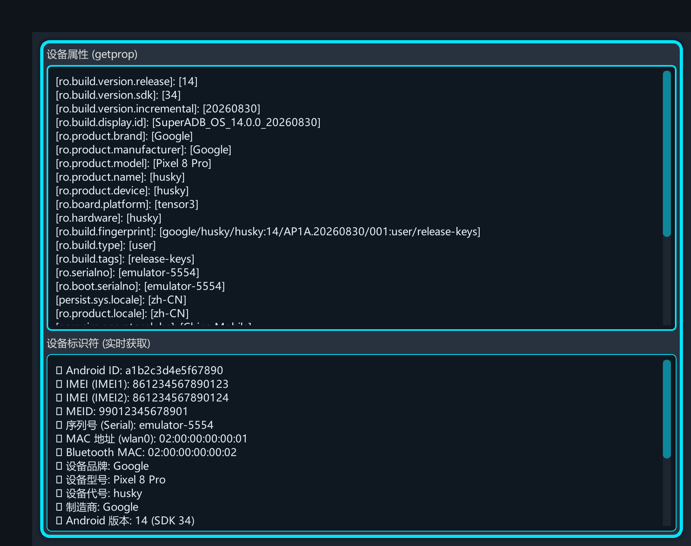

**功能介绍**

设备详细信息查看工具，一键获取设备型号、Android 版本、序列号、屏幕分辨率、IP 地址、MAC 地址、CPU 架构、内存大小、存储容量、电池状态、Root 状态等全面信息。

**使用说明**

1. 选择设备后自动加载全部设备信息
2. 按类别分组显示（基本信息/硬件/网络/电池/系统）
3. 点击任意字段可复制该信息
4. 「导出」按钮可将全部设备信息保存为文本文件
5. 支持多设备信息对比查看

---

## 📜 证书安装

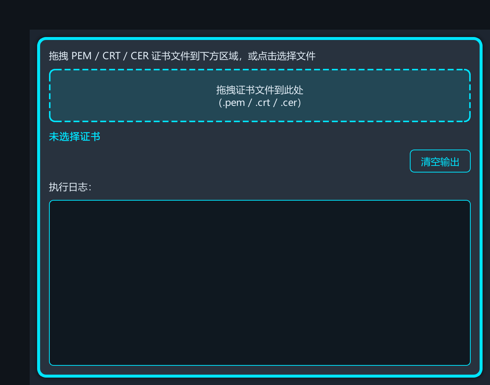

**功能介绍**

CA 证书安装工具，支持将 Charles/Fiddler/mitmproxy 等抓包工具的 CA 证书安装到设备系统证书目录（需 root）。自动转换证书格式，安装后可直接抓取 HTTPS 流量。

**使用说明**

1. 选择抓包工具导出的 CA 证书文件（.pem/.crt/.cer）
2. 自动检测证书格式并转换为 Android 系统证书格式（hash.0）
3. root 设备一键安装到 /system/etc/security/cacerts/
4. 安装后设备自动信任该 CA，可抓取 HTTPS 流量
5. 支持查看已安装的系统证书列表和卸载

---

## ⚙️ 环境配置

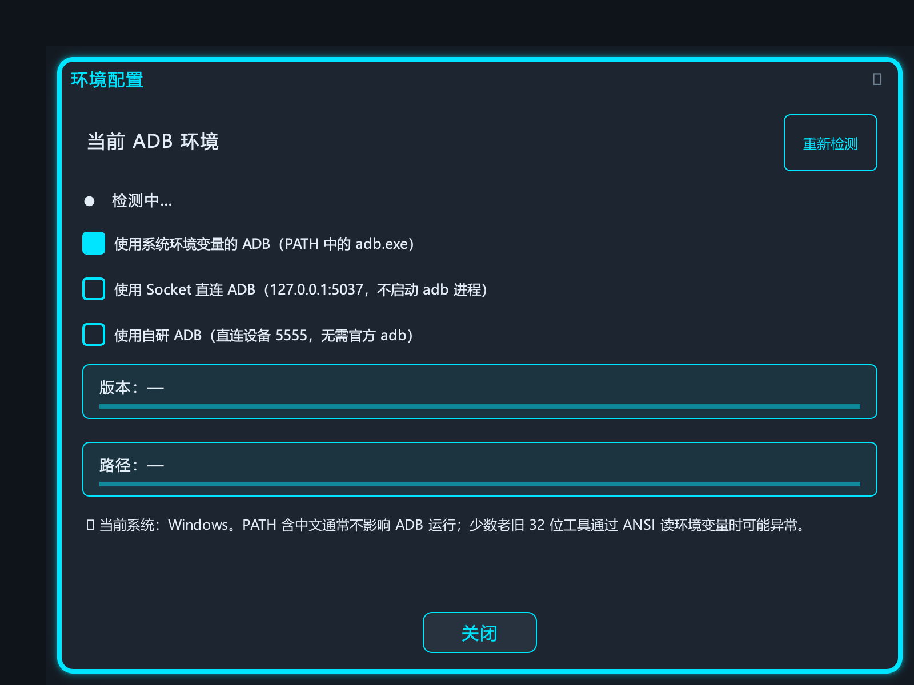

**功能介绍**

全局环境配置工具，设置 ADB 路径、scrcpy 路径、tcpdump 路径、默认主题、语言、截图保存目录、日志级别等。配置自动保存，修改后即时生效。

**使用说明**

1. 「ADB 路径」设置官方 adb 可执行文件位置，留空使用内置
2. 「scrcpy 路径」设置投屏工具路径，留空使用内置
3. 「默认主题」选择启动时加载的主题
4. 「截图保存目录」设置自动生成截图的保存位置
5. 配置修改后自动保存，重启后生效

---

## 📢 关注公众号

扫码关注公众号，获取最新版本更新、使用教程和技术分享。

## 📥 下载地址

下载地址：https://pan.quark.cn/s/2b7b11ebe1e5?pwd=fAXN
